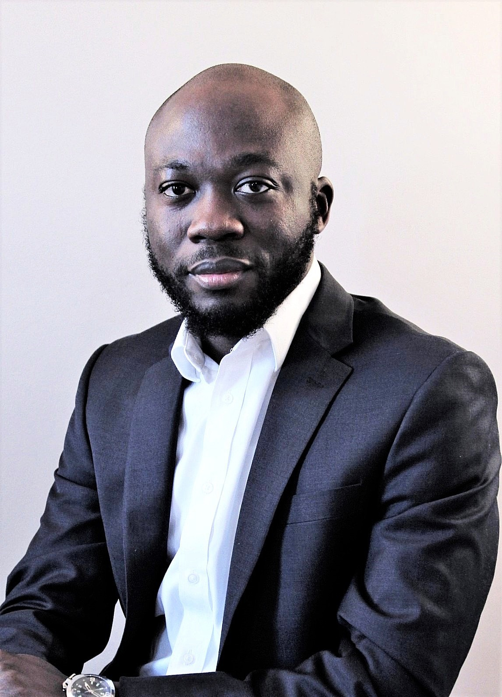

 

 

 

I am an Assistant Professor of Economics at Mohammed VI University, Morocco. My primary research interest is Econometrics (Theoretical and Applied).

 

 

<!--
<a href="Tsyawo_JMP.pdf#" class="download" title="Download JMP as PDF">Job Market Paper</a>
-->

 

<a href="Tsyawo_CV.pdf#" class="download" title="Download CV as PDF">Curriculum Vitae</a>			

 

<!--Email: estsyawo[at]temple[dot]edu, estsyawo[at]gmail[dot]com-->
**Email**: estsyawo [at] gmail [dot] com

**Address**: Université Mohammed VI Polytechnique, 

Faculté de Gouvernance, Sciences Economiques et Sociales (FGSES)

Technopolis, Rocade Rabat-Salé, Morocco

 

**Scheduled presentations**: 

<!--
* 58th Annual Meeting of the Canadian Economics Association, Toronto, Canada, (May/June 2024)

* Africa Meeting of the Econometric
Society (AFES), Abidjan, Côte d'Ivoire (June 2024)

* North American Summer Meeting of the Econometric Society (NASMES), Nashville, Tennessee, (June 2024)

* The 29th International Panel Data Conference (IPDC), Orléans, France (July 2024)
-->

* Bernoulli-IMS 11th World Congress in Probability and Statistics, Bochum, Germany (August 2024)

* European Summer Meeting of the Econometric Society, Rotterdam, Netherlands (August, 2024)

